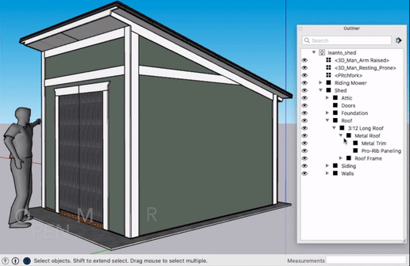

# HideMoreLess
A Sketchup Ruby plugin to manage selective hiding in nested entity heirarchies.

This simple Ruby Sketchup plugin permits selective hiding of groups and components not on the "ancestor tree" of the active path (i.e the nested list of opened groups or components).

## Install

Just search HideMoreLess in the Extension Warehouse. Or, download the [latest version](https://github.com/jdtsmith/hidemoreless/releases/latest) and `Install Extension` in Extension Manager to browse for this new `.rbz` file and install it.

## Usage

Look for 2 new commands under `Edit` — `Hide Less` and `Hide More`. I bind them to `Ctrl -` and `Ctrl +`, but of course you could pick anything.  One invocation of `Hide More` hides all non-ancestor _top level_ groups/components (only, bare geometry is left alone). An additional invocation of `Hide More` then goes one level deeper (with feedback in the status window), and so on, until you hit the maximum depth, which is reported.
To unhide, you can `Hide Less`, or simply close the component. Closing all the way out to the top level disables and unhides everything which _HideMoreLess_ hid.  Jumping directly from one deeply nested component to another on a completely distinct path (e.g. in the Outliner), will reapply the existing depth setting (up to the maximum).  Anything which is already hidden or on an non-visible layer/tag will be left alone, so that unwanted hidden components don’t reappear.  _HideMoreLess_ attempts to gracefully handle saves (including auto-saves) during which all open components are closed and then re-opened by Sketchup. 

Models are independent, so you can have different hide depths on different models at the same time (on Mac).

## Bindings

My complete bindings:

| Key        | Command |
| ------------------- | ------------- |
| Shift-h | Hide Rest of Model |
| Ctrl-Shift-h | Hide Similar Components |
| Ctrl - | Hide Less |
| Ctrl + | Hide More |

I find this set really convenient. Sometimes you want to work only on the group or component at hand. But sometimes you need more context. If you toggle “rest of model” back on (Shift-h, or simply let HideMoreLess do this for you) and find it’s TMI, a quick `Ctrl +` or two will clear the unrelated stuff away and drill down to just the surrounding context. It can even be useful to invoke during drawing/measurement actions: alternate between a bit more and then less context to reveal the geometry of interest. It really shines when you nest down fairly deeply: 5 levels or more. It will probably be most useful when components that are nearby in the hierarchy are physically close together.
